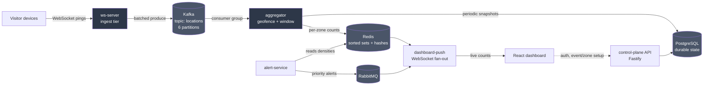

# ConPulse

**Real-time crowd-density monitoring for large events.**

---

## Table of contents

- [What it does](#what-it-does)
- [Architecture](#architecture)
- [The data flow, step by step](#the-data-flow-step-by-step)
- [Key design decisions](#key-design-decisions)
- [Performance](#performance)
- [Tech stack](#tech-stack)
- [**Running it locally**](#running-it-locally)
- [Configuration](#configuration)
- [Engineering notes & war stories](#engineering-notes--war-stories)
- [What's next?](#whats-next)

---

## What it does

An event organizer signs up, creates an event, and defines its zones (each with a location and safety thresholds) by dropping pins on a map. Once the event is live, visitor devices connect and stream location pings. ConPulse:

- **Geofences** every ping into the nearest zone.
- Maintains a **live count of people currently in each zone** over a rolling 15-second window.
- **Streams those counts** to a live dashboard (map, per-zone charts, alert feed).
- **Raises alerts** when a zone crosses its warning or critical threshold — with critical alerts prioritized over routine ones.

---

## Architecture

The system is a pipeline of small, single-purpose services decoupled by a message log. The core insight is **separation of concerns along the data flow**: ingest is dumb and fast (scales horizontally), Kafka absorbs bursts (decouples ingest speed from processing speed), the aggregator holds all analytical complexity in one place, and Redis serves reads cheaply. Each stage scales and fails independently.




- **PostgreSQL** holds *durable structure* — users, orgs, events, zone definitions, density history. Slow-changing, relational, transactional.
- **Redis** holds the *live present moment* — who's in which zone right now. Fast, in-memory, overwritten constantly, self-healing.
- **In-process cache** stores the latest timestamp of each user. It reduces the unnecessary Redis writes and checks in case the ping received is older than the newest ping; or the user has remained stationary for a while. Thereby avoiding redundant network round-trips.
- **Kafka** is the *stream between them*.

---

## The data flow, step by step

1. **Ingest (`ws-server`).** Visitor devices open WebSockets and stream pings. The ingest server does pushes the pings into an in-memory batch. A background timer flushes the whole batch to Kafka once per second. It holds no analytical state.

2. **Buffer (`Kafka`).** Pings land on the `locations` topic, partitioned 6 ways and keyed by visitor token — which spreads load evenly across partitions while keeping each visitor's pings ordered on one partition.

3. **Aggregate (`aggregator`).** A consumer group reads the stream. For each ping it computes the nearest zone (geofencing) and refreshes that visitor's presence in a Redis sorted set scored by arrival time. A background loop evicts anyone older than the 15-second window and writes the resulting count as each zone's live density. An in-process L1 cache skips redundant writes for stationary visitors, cutting Redis writes ~3.9×. Stationary users are periodically heartbeated to Redis to avoid eviction. 

4. **Serve (`Redis`).** The live per-zone counts sit in Redis, read cheaply by downstream services.

5. **Fan out (`dashboard-push`).** Reads live densities from Redis and streams them over WebSockets to every open dashboard. Also relays alerts from RabbitMQ.

6. **Display (`web`).** A React dashboard renders the live map, per-zone density charts, and the alert feed.

**Alongside the hot path:**

- **`alert-service`** polls densities and publishes alerts through RabbitMQ when a zone changes severity (edge-triggered — one alert per transition, not a stream), with critical alerts ranked above routine ones via priority queues.
- **`api`** (control-plane) is the non-real-time side: auth, and the organizer flow for creating orgs, events, and zones.

---

## Key design decisions

**Kafka for telemetry, RabbitMQ for alerts.** Pings are a high-volume, ordered, replayable stream, so it is done by Kafka. Its partitioning is what enables parallel processing. Alerts are the opposite: rare, discrete, and rankable. A critical crowd-crush alert must preempt routine notices, which a strictly-ordered Kafka log cannot do but a RabbitMQ priority queue can. Two traffic types, two tools.

**At-most-once ingest, at-least-once alerts.** Under overload the ingest tier *drops* pings rather than buffering them into an out-of-memory crash — safe because density is self-refreshing (each visitor pings repeatedly, so a dropped ping is one lost sample, not a lost person). Alerts take the opposite approach, because a lost crowd-crush warning is unacceptable.

**Geofencing by nearest-center.** Each ping is assigned to the nearest zone center using a cheap planar distance approximation. Simpler than polygon containment and accurate enough for well-separated zones; PostGIS polygons are the upgrade path if zones become irregular.

---

## Performance

Measured on a single machine running the full stack plus a co-located load generator. These are the load generator's ceiling, not the system's — the pipeline was still healthy at peak.

| Metric | Result |
|---|---|
| Sustained concurrent connections | ~28,000 |
| Throughput (single consumer → scaled) | ~1,200 → ~28,000 msgs/sec |
| Processing latency (p95, balanced 3-consumer group) | ~1.05 s |
| Redis write reduction (L1 cache, measured) | \~3.9x (~74% of writes skipped) |
| Load-shedding fairness | uniform per-zone acceptance (verified) |

**Scaling story.** A single consumer processes ~1,200 msgs/sec and falls behind (unbounded lag) under higher load. Partitioning the topic 6 ways and running a balanced consumer group brings lag under control (bounded, self-recovering) and raises sustained throughput accordingly.

**Latency framing.** The ~1 s figure is an *under-load* measurement on constrained single-machine hardware, with real per-ping work in that window (geofencing, Redis sliding-window operations, Kafka hops). Under capacity it stays bounded and stable; it climbs only when consumers are deliberately saturated.

---

## Tech stack

| Layer | Technology |
|---|---|
| Ingest & services | Node.js, Fastify, `@fastify/websocket` |
| Streaming | Apache Kafka (KRaft mode), KafkaJS |
| Live state | Redis (sorted sets, hashes), ioredis |
| Durable state | PostgreSQL, `pg` |
| Alerts | RabbitMQ (topic exchange, priority queues), amqplib |
| Frontend | React, Vite, Leaflet, Recharts |
| Auth | JWT, bcrypt |
| Infrastructure | Docker Compose |

---

## Running it locally

**Prerequisites:** Node.js 18+, Docker & Docker Compose.

```bash
# 1. Start the backing infrastructure (Kafka, Redis, Postgres, RabbitMQ)
docker compose -f infra/docker-compose.yml up -d

# 2. Install dependencies (workspaces)
npm install

# 3. Initialize the database schema
psql "$DATABASE_URL" -f db/0001_init.sql

# 4. Start the services (each in its own terminal, or via run-stack.sh)
npm run start --workspace services/api
npm run start --workspace services/ws-server
npm run start --workspace services/aggregator
npm run start --workspace services/dashboard-push
npm run start --workspace services/alert-service

# 5. Start the dashboard
npm run dev --workspace web

# 6. Generate load (simulated crowd of 2000 visitors)
node simulator/feed.js 2000
```

Then open the dashboard, sign up, create an event and its zones, activate it, and point the simulator at its slug to watch the crowd move in real time.

> **Note:** the aggregator can be scaled by starting multiple instances — they form a Kafka consumer group and share the partitions. For balanced load, use a consumer count that divides the partition count (1, 2, 3, or 6).

---

## Configuration

Services read configuration from environment variables (via a `.env` file at the repo root):

| Variable | Purpose |
|---|---|
| `KAFKA_BROKERS` | comma-separated broker addresses |
| `REDIS_URL` | Redis connection string |
| `DATABASE_URL` | PostgreSQL connection string |
| `RABBITMQ_URL` | RabbitMQ connection string |
| `JWT_SECRET` | secret for signing auth tokens |
| `WS_PORT` | ingest WebSocket port (default 3002) |

---

## Engineering notes \& war stories

These are some of the problems I faced during development and how each was tackled.

1. <u>**The ingest out-of-memory (OOM) crash**</u>

* **Symptom:** under load the ingest server climbed to \~2 GB and crashed, taking the live view to zero.
* **Cause:** un-awaited `producer.send()` calls per ping — fire-and-forget I/O that buffered unboundedly in the heap faster than Kafka could drain it.
* **False start:** awaiting each send *still* OOM'd — the WebSocket kept firing message events, so pending handler closures piled up instead of pending sends. Awaiting inside an event handler doesn't slow the event *source*.
* **Fix:** make the handler do *no* awaited work — synchronously push each ping onto an in-memory array, and let a timer flush the whole batch to Kafka once per second. A bounded cap on the array sheds load rather than growing unboundedly.
* **Result:** memory went flat.

2(a). <u>**Load-shedding without losing the crowd**</u>

* **The worry:** dropping pings sounds like dropping people.
* **Why it isn't:** each visitor pings repeatedly, and density is a windowed count that needs only *one* recent ping per person to register them. A dropped ping is a lost sample, not a lost person.
* **Why zones stay fair:** shedding is content-blind — it drops whatever arrives when saturated, so drops distribute proportionally across all zones. The crowd's *shape* is preserved; only its update frequency drops.
* **How it was verified:** compared per-zone *sent* counts (from the load generator, classified by the same geofencing rule) against *received* counts (from the aggregator). Acceptance stayed uniform across zones under shedding — proof the degradation was even, not biased.

2(b). <u>**Inaccurate metric while measuring shape-distortion due to load-shedding**</u>

* **Symptom:** a per-zone "received" counter read \~44% of "sent" even at trivial load with no shedding — apparent unfairness.
* **Cause:** The counter increment was queued into a Redis pipeline that only got executed when a density write also occurred — but stationary visitors, by design, skip density writes via my L1 cache. So on write-less batches, the pipeline was skipped and the queued count increments were silently discarded. The pings were processed fine; the measurement was throwing away its own data on exactly the batches where the cache did its job.
* **Diagnosis:** the system was fine; the *measurement* was broken.
* **Fix:** execute the pipeline whenever *anything* was queued, not only when a write happened.

3. <u>**Density suddenly crashed to zero**</u>

* **Symptom:** the dashboard would occasionally collapse to zero and stick there.
* **Cause 1 (watermark wipe):** an event-time watermark used for window cleanup would lurch forward at stream discontinuities and evict entire zones at once.
* **Cause 2 (clock mismatch):** visitors were *scored* in the Redis sorted set by their lagged event timestamp but *evicted* against wall-clock time. Once lag exceeded the window, every newly-added visitor was already older than the eviction cutoff — deleted the instant it was added.
* **Fix:** score by ingestion (wall-clock) time, so adding and evicting speak the same clock.
* **Lesson:** event-time answers "which happened first," wall-clock answers "how long ago" — never compare one against the other.

---

## What's next?

- **Backing stores are single-node** (Kafka, Redis, Postgres) — the real single points of failure. Production: cluster/replicate all three.
- **Ingest clustering is single-machine** (Node `cluster` module). Production: replicated stateless containers behind a load balancer under an orchestrator, which also survives whole-machine failure — the cluster primary is itself an unsupervised single point of failure.
- **Load numbers are from a co-located synthetic generator**, so they reflect the test rig's ceiling, not the system's. Real load testing uses separate generator machines.
- **Geofencing is nearest-center**, not true polygons. Upgrade path: PostGIS.
- **`density_history` is a plain table.** At production time-series volume: TimescaleDB (a Postgres extension) for partitioning and retention.
- **RabbitMQ reconnect lacks backoff**, and alerts generated during a broker outage aren't buffered. Production: exponential backoff with jitter, plus a persistent outbox.

---
